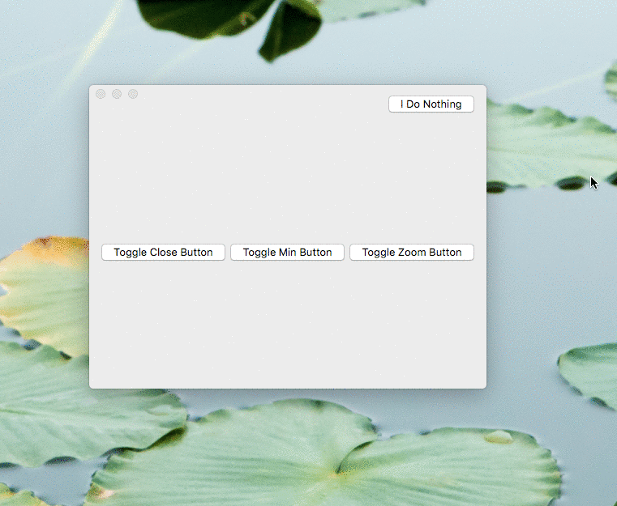
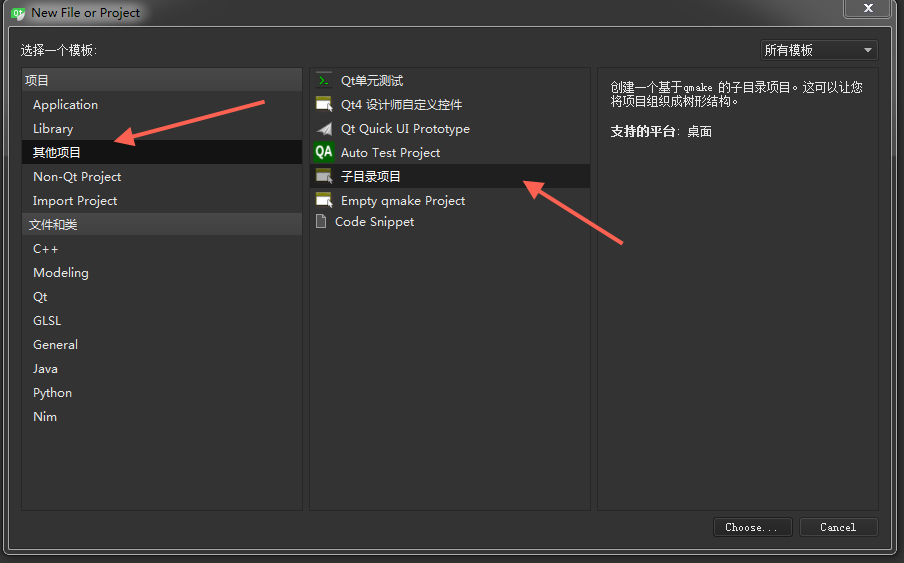
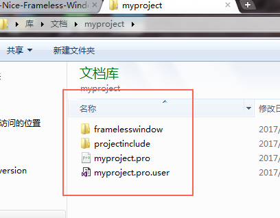
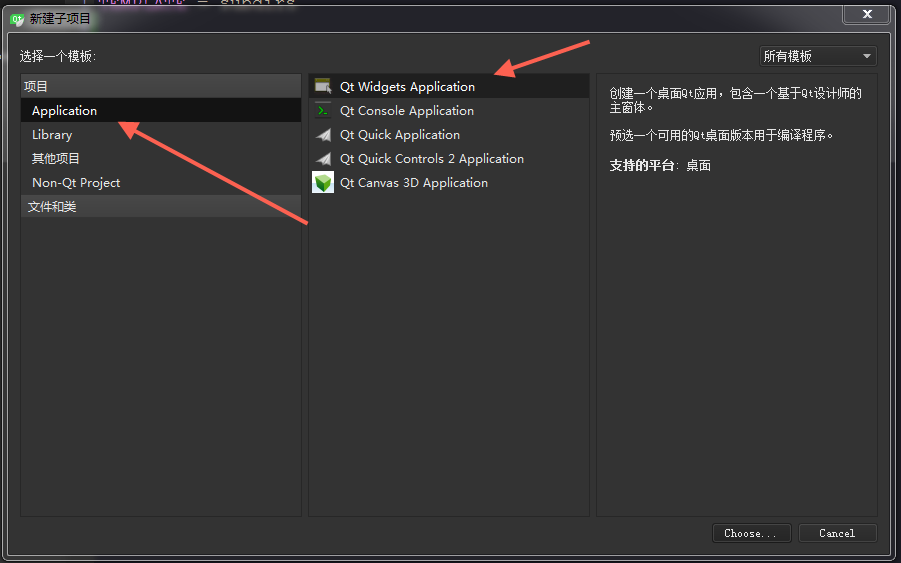
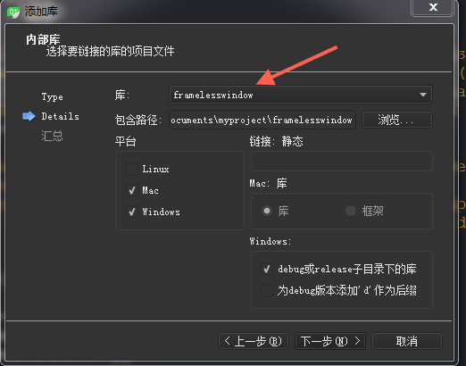
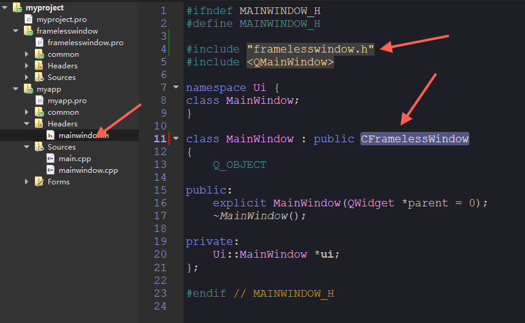
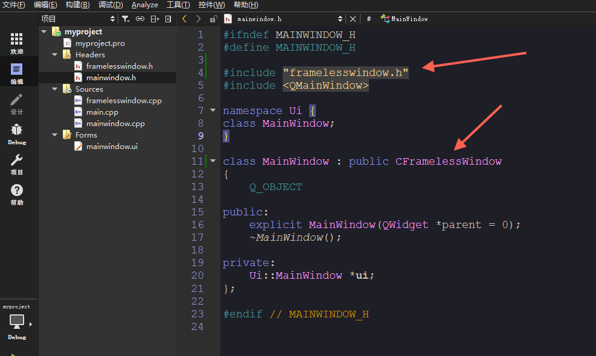

# Qt-Nice-Frameless-Window

Qt Frameless Window for both Windows and OS X, support Aero Snap, drop shadow on Windows, and support Native Style such as round corner, drop shadow on OS X. Based on QMainWindow.

基于 QMainWindow 实现的效果很好的 Qt 无边框窗口,支持 Windows 和 OS X 系统。在 Windows 上，支持窗口阴影、Aero 效果等；在 OS X 上，支持原生窗口样式，比如窗口圆角、窗口阴影、三个系统按钮(关闭、最小化、最大化）等。

# Screenshots
| Windows | OS X|
|:-------------:|:-------------:|
|   | |


# How to use
Just use class "CFramelessWindow" as the base class instead of QMainWindow, and Enjoy!

## Method 1
If you want to create a new project, then method 1 should be used.   
1. Create a new Qt subproject project say myproject.pro, just like Qt-Nice-Frameless-Window.pro.
 
2. Copy folder "framelesswindow" and "projectinclude" to myproject path, the project directory structure should be looked like this:   
  -myproject/   
  &nbsp;&nbsp;-myproject.pro   
  &nbsp;&nbsp;-myproject.pro.user   
  &nbsp;&nbsp;-framelesswindow/   
  &nbsp;&nbsp;-projectinclude/  
 
  
3. Add "SUBDIRS += framelesswindow" in myproject.pro and run qmake.
 
4. Add a sub project say myapp.pro to myproject. 

| 1 | 2 |
|:-------------:|:-------------:|
|  |  |

5. Add "myapp.depends = framelesswindow" in myproject.pro and run qmake.
6. Add "include (../projectinclude/common.pri)" in myapp.pro and run qmake.
7. Right click on myapp.pro, and click "add library", a dialog will pop up, choose "interal library" and click next step again and again.

| 1 | 2 | 3 |
|:--:|:--:|:--:|
|  |  |  |
8. After step 7 is done, something will be added into the myapp.pro file automaticly, run qmake again.
 
9. Use class "CFramelessWindow" as the base class instead of QMainWindow.
 

## Method 2
If you already have a project say myproject.pro, then method 2 should be used.
1. Copy file "framelesswindow.h" and "framelesswindow.cpp" and "framelesswindow.mm" to myproject path.
 
2. Add these lines to myproject.pro, then run qmake.
```
HEADERS += \
    framelesswindow.h

win32{
	SOURCES += \
		framelesswindow.cpp
}
macx{
    OBJECTIVE_SOURCES += \
		framelesswindow.mm
    LIBS += -framework Cocoa
}
```
3. Use class "CFramelessWindow" as the base class instead of QMainWindow.

| 1 | 2 |
|:-------------:|:-------------:|
|  |  |

# Windows Specific
- The window have no title bar by default, so we can not move the window around with mouse. Inorder to make the window moveable, protected member function **``` setTitleBar(QWidget* titlebar) ```** should be called in the MainWindow's Constructor, the widget "titlebar" should be a child widget of MainWindow, and it will act exactly same as SYSTEM Title Bar.

- Widget "titlebar" may has its own child widget, such as "close button" and "max button", and we can NOT move the window with "close button", which is what we want. However, a label widget "label1" on "titlebar" should not cover the moveable functionality, the protected member function **```addIgnoreWidget(QWidget* widget)```** is designed to deal with this kind of situation, just call **```addIgnoreWidget(ui->label1)```** in MainWindow's Constructor.

- **```setResizeableAreaWidth(int width = 5)```** can set width of an invisible border aera, inside this aera, window can be resized by mouse.

- **```setResizeable(bool resizeable)```** can set whether the window can be resized by mouse or not.

- Exampleforwindows shows the general usage.

- **WARNING**: resize()/geometry()/setGeometry()/frameGeometry()/frameSize()/x()/y()/.etc function will not works right when the Window is Maximized, try not to use any of these function when the Window is Maximized (If you really want to fix these bugs, feel free to contact [Bringer-of-Light](https://github.com/Bringer-of-Light)) . But these function setContentsMargins()/contentsMargins()/getContentsMargins/contentsRect() can always works right, so you can use them anytime. Generally , it's always a good idea to use Qt Layout Management System instead of hard-code layout Management to avoid potential size-like/pos-like issue. 

# OS X Specific
- The whole window is draggable by default. **``` setDraggableAreaHeight(int height) ```** can set the draggable area height, in draggable area, window can be moved by mouse, (height = 0) means that the whole window is draggable.

- Native style（three system button/ round corner/ drop shadow） works only on OS X 10.10 and later. If **``` isNativeStyleOK() ```** return false, we should implement three custom button(close/ min/ max).

- If Native style is OK, three system button is provided by OS X. On OS X 10.10 and later, the default behavior of Zoom Button(Green Button) is to FullScreen the window, and this will cause some anoying issue: when the window returns to normal size from fullscreen state, the System Title Bar show again! As a result, CFramelessWindow override the behavior of Zoom Button to Maximized (Not FullScreen) the window.

- If Native style is OK, the default behavior of close button is to quit the application. If we want to hide the app instead of quit, use **``` setCloseBtnQuit(false) ```**. Be carefull that after set this to false, we can NOT revert it to true again! And this funciton should NOT be called more than once!

- If Native style is OK, all there system button can be disabled by **``` setCloseBtnEnabled(false) ```**, **``` setMinBtnEnabled(false) ```**, **``` setZoomBtnEnabled(false) ```**.

- Exampleformac shows the general usage.


# Platform
- Tested with Qt5.9.2.
- Tested on Windows 7 (with visual studio 2015) , Windows 10 (with visual studio 2015), OS X 10.10.2.

# Acknowledge
- [Mixing cocoa and qt](https://el-tramo.be/blog/mixing-cocoa-and-qt/)
- [Mixing Objective-C, C++ and Objective-C++: an Updated Summary](http://philjordan.eu/article/mixing-objective-c-c++-and-objective-c++)
- [objective c - Setting C function as selector for NSButton produces no results - Stack Overflow](https://stackoverflow.com/questions/27643659/setting-c-function-as-selector-for-nsbutton-produces-no-results)
