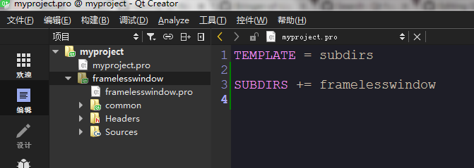
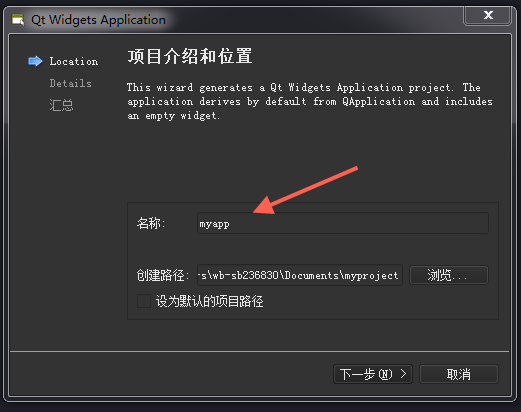
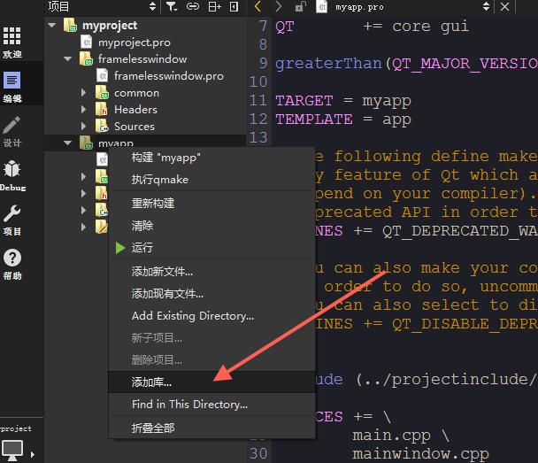
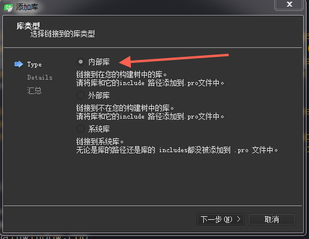
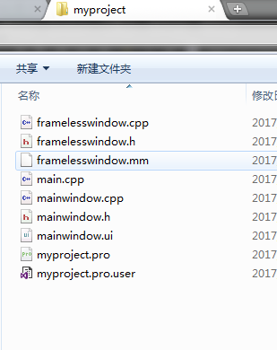
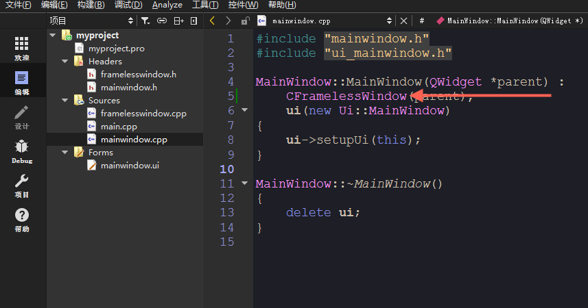

# Qt-Nice-Frameless-Window
Qt Frameless Window for both Windows and OS X, support Aero Snap, drop shadow on Windows, and support Native Style such as round corner, drop shadow on OS X. Based on QMainWindow.

# Screenshots
| Windows | OS X|
|:-------------:|:-------------:|
|   | |


# How to use
Just use class "CFramelessWindow" as the base class instead of QMainWindow, and Enjoy!

## Method 1
If you want to create a new project, then method 1 should be used.   
1. Create a new Qt subproject project say myproject.pro, just like Qt-Nice-Frameless-Window.pro.
 
2. Copy folder "framelesswindow" and "projectinclude" to myproject path, the project directory structure should be looked like this:   
  -myproject/   
  &nbsp;&nbsp;-myproject.pro   
  &nbsp;&nbsp;-myproject.pro.user   
  &nbsp;&nbsp;-framelesswindow/   
  &nbsp;&nbsp;-projectinclude/  
 
  
3. Add "SUBDIRS += framelesswindow" in myproject.pro and run qmake.
 
4. Add a sub project say myapp.pro to myproject. 

| 1 | 2 |
|:-------------:|:-------------:|
|  |  |

5. Add "myapp.depends = framelesswindow" in myproject.pro and run qmake.
6. Add "include (../projectinclude/common.pri)" in myapp.pro and run qmake.
7. Right click on myapp.pro, and click "add library", a dialog will pop up, choose "interal library" and click next step again and again.

| 1 | 2 | 3 |
|:--:|:--:|:--:|
|  |  |  |
8. After step 7 is done, something will be added into the myapp.pro file automaticly, run qmake again.
 
9. Use class "CFramelessWindow" as the base class instead of QMainWindow.
 

## Method 2
If you already have a project say myproject.pro, then method 2 should be used.
1. Copy file "framelesswindow.h" and "framelesswindow.cpp" and "framelesswindow.mm" to myproject path.
 
2. Add these lines to myproject.pro, then run qmake.
```
HEADERS += \
    framelesswindow.h

win32{
	SOURCES += \
		framelesswindow.cpp
}
macx{
    OBJECTIVE_SOURCES += \
		framelesswindow.mm
    LIBS += -framework Cocoa
}
```
3. Use class "CFramelessWindow" as the base class instead of QMainWindow.

| 1 | 2 |
|:-------------:|:-------------:|
|  |  |

# Windows Specific
- The window have no title bar by default, so we can not move the window around with mouse. Inorder to make the window moveable, protected member function **``` setTitleBar(QWidget* titlebar) ```** should be called in the MainWindow's Constructor, the widget "titlebar" should be a child widget of MainWindow, and it will act exactly same as SYSTEM Title Bar.

- Widget "titlebar" may has its own child widget, such as "close button" and "max button", and we can NOT move the window with "close button", which is what we want. However, a label widget "label1" on "titlebar" should not cover the moveable functionality, the protected member function **```addIgnoreWidget(QWidget* widget)```** is designed to deal with this kind of situation, just call **```addIgnoreWidget(ui->label1)```** in MainWindow's Constructor.

- **```setResizeableAreaWidth(int width = 5)```** can set width of an invisible border aera border, inside this aera, window can be resized by mouse.

- By default, class CFramelessWindow will autoadjust window margins to avoid an annoying issue: The frameless window will extend OUT of the screen when it's in maximized state, because the OS believe that it still have border. When we maximize the window, OS will make the border invisible, and maximize the content aera to display more info.

- The side-effect of "Auto Adjust Margins" is that when the window restore to normal size, a twinkle will occur. If we really don't like the twinkle, use **```setAutoAdjustMargins(false)```**. But we'd better reserve enough blank area with **```setContentsMargins(false)```**.

# OS X Specific
- TODO


# Platform
- Tested with Qt5.9.2.
- Tested on Windows 7 (with visual studio 2015) and OS X 10.10.2.
